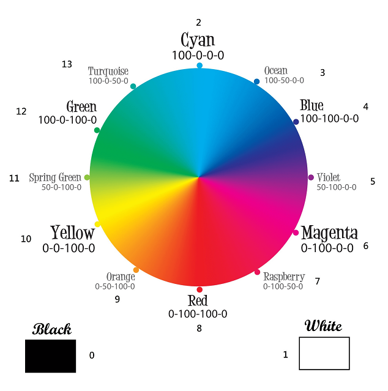

# Matrix Color Sensor Arduino Library
Matrix Color sensor is an RGBW color sensor, 
communicate by I2C interface.
## Features
Support RGB, CMYK, and Grayscale format.  
Internal 14 colors auto-detect send by number.
## Repository Contents
* [**/docs**](./docs) - MATRIX Color Sensor documentation.
* [**/examples**](./examples) - Example sketches for the library (.ino). Run these by Arduino IDE.
* [**/src**](./src) - Source files for the library (.cpp, .h).

## Documentation
[Function Description](https://matrix-robotics.github.io/MatrixColorSensor/)  
[MATRIX Official Website](https://matrixrobotics.com/)
## License
MIT

## Number of Color

